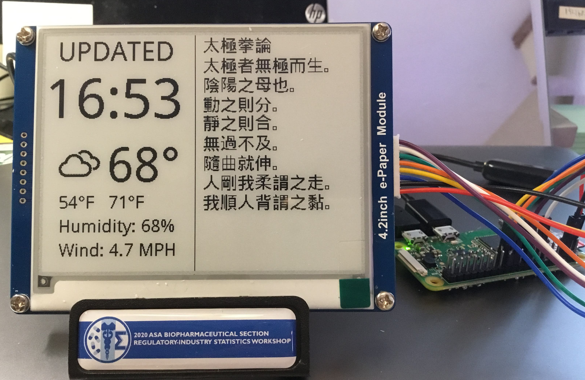
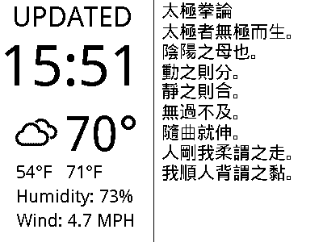

<h1>E-paper Weather Display</h1>
  Raspberry Pi weather display using Waveshare e-paper 4.2 inch display, Open Weather Map API, and Python.

  This is a fork from the work of [AbnormalDistributions](https://github.com/AbnormalDistributions/e_paper_weather_display) v1.7 for my own need.

 

  

<h1>Setup</h1>
  <ol type="1">
    <li>The first thing you need is a free API key from https://home.openweathermap.org/users/sign_up.</li>
    <li>Open 'weather.py' and replace **Key Here** with your API key.</li>
    <li>**Location** can be left as it is unless you want to add it to your display.</li>
    <li>Get your **longitude** and **lattitude** using I used https://www.latlong.net and put that in as well.</li>
    <li>Set CSV_OPTION to False if you would not like weather data appended to 'records.csv' after every refresh.</li>
    <li>There is also a reminder for taking out the trash near the end of the script that you will want to change if your trash pickup doesn't come on Monday and Thursday like mine. :)</li>
  </ol>
 
That's about it. Run the python file (**python3 weather.py**) and you should see output on the display. 

# Note 
If you are not using a 4.2 inch display, you will want to replace 'epd4in2.py' in the 'lib' folder with whichever one you have from https://github.com/waveshare/e-Paper/tree/master/RaspberryPi%26JetsonNano/python/lib/waveshare_epd 
Fairly extensive adjustments will have to be made for other sized screens.

# Parts
<ul>
  <li>https://www.waveshare.com/wiki/4.2inch_e-Paper_Module</li>
  <li>Raspberry Pi zero.</li>
  <li>SD card for the Pi at least 8 GB.</li>
  <li>Power supply for the Pi.</li>
</ul>

<h1>Credit</h1>
  Icon designs are originally by [Erik Flowers] (https://erikflowers.github.io/weather-icons/). Some icons have been modified. 

<h1>Licensing</h1>
  <ul>
    <li>Weather Icons licensed under [SIL OFL 1.1](http://scripts.sil.org/OFL)</li>
    <li>Code licensed under [MIT License](http://opensource.org/licenses/mit-license.html)</li>
    <li>Documentation licensed under [CC BY 3.0](http://creativecommons.org/licenses/by/3.0)</li>
  <ul>
